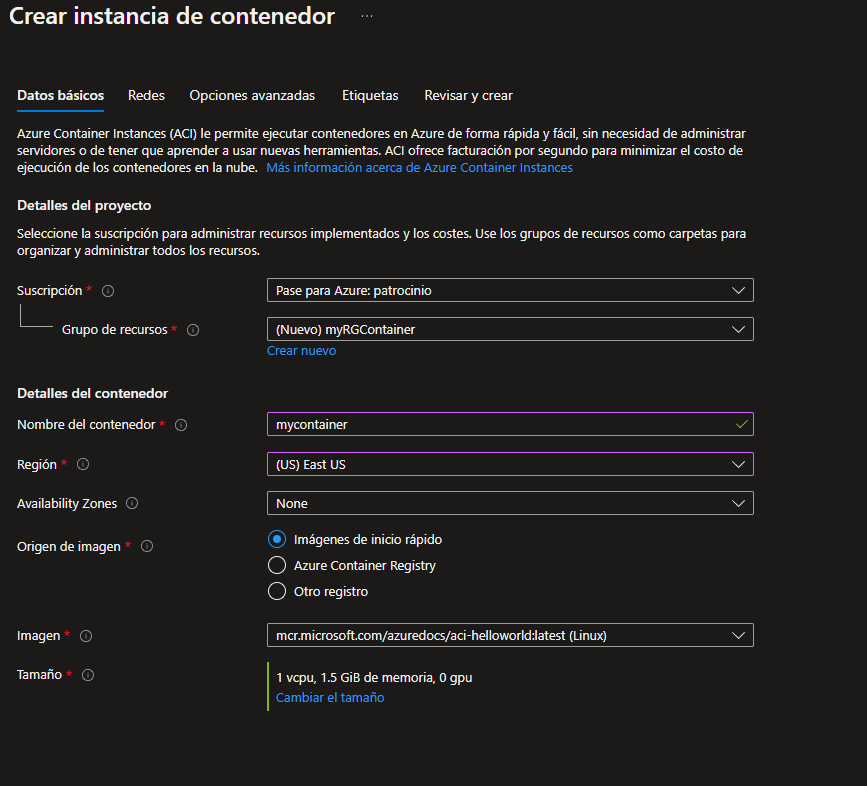
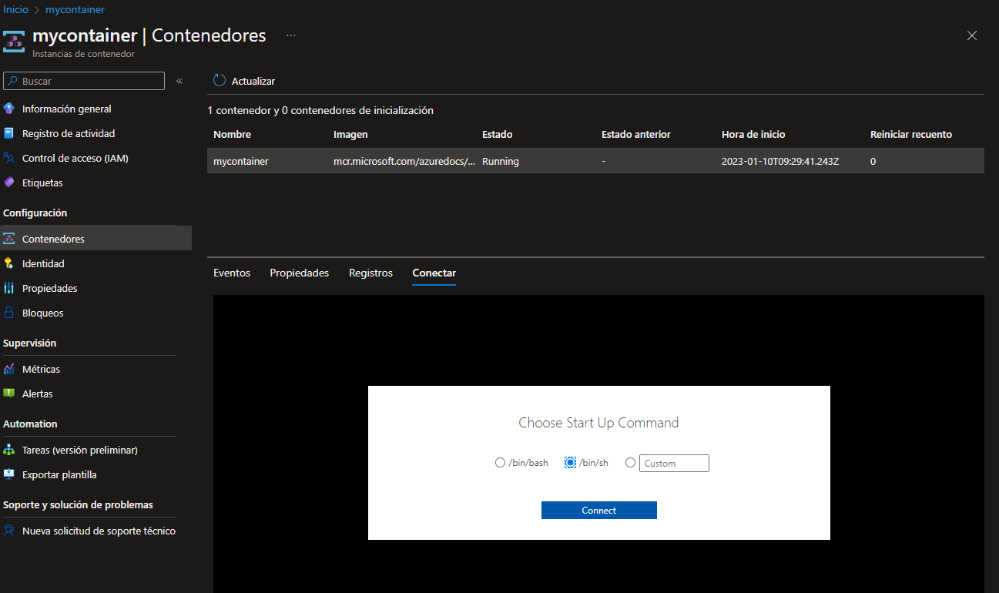
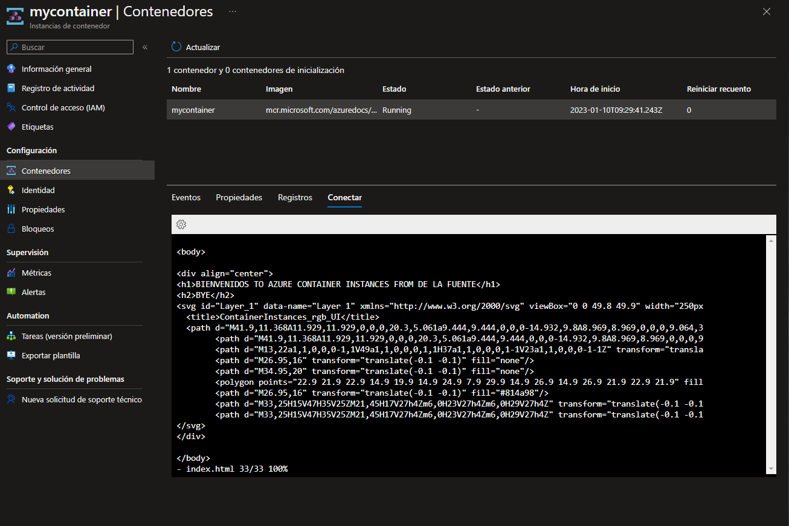
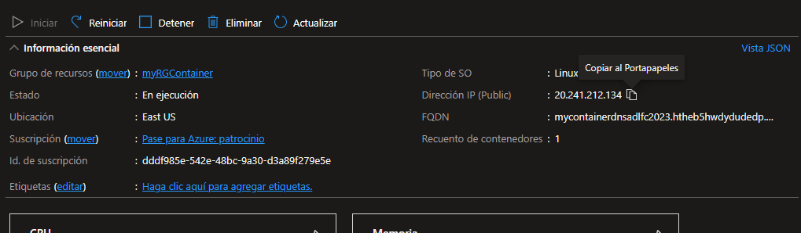
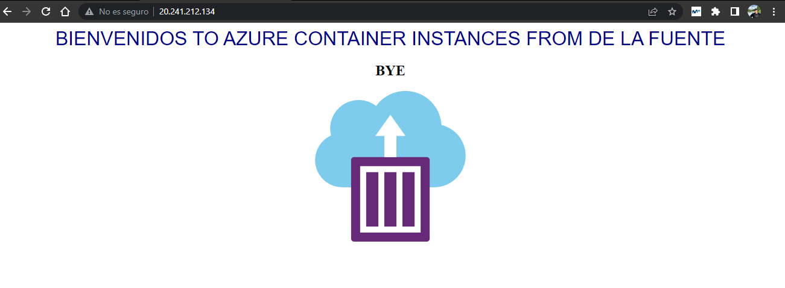

# Implementación de Azure Container Instances

Vamos a crear, configurar e implementar un contenedor Docker mediante Azure Instances (ACI) en Azure. El contenedor es una aplicación web Bienvenido a ACI que muestra una página HTML estática.

### PASO 1: Crear instancia de contenedor

Desde la hoja **Todos los servicios**, buscamos y seleccionamos **Container instances** y luego hacemos clic en **Crear**.

Tendremos que añadir los siguientes datos:

| Configuración             | Valor                                          |
| ------------------------- | ---------------------------------------------- |
| Suscripción               | **Elija su suscripción**                       |
| Grupo de recursos         | **myRGContainer** (crear nuevo)                |
| Nombre del contenedor     | **mycontainer**                                |
| Región                    | **(EE. UU.) Este de EE. UU.**                  |
| Origen de imagen          | **Imágenes de inicio rápido**                  |
| Imagen                    | **mcr.microsoft.com/azuredocs/aci-helloworld** |
| Tipo de sistema operativo | **Linux**                                      |
| Tamaño                    | ***Dejar en el valor predeterminado***         |

Configuramos la pestaña de Redes (reemplazamos **xxxx** con letras y dígitos para que el nombre sea globalmente único). Deje todas las demás configuraciones en sus valores predeterminados.

| Configuración          | Valor                  |
| ---------------------- | ---------------------- |
| Etiqueta de nombre DNS | **mycontainerdnsxxxx** |

Hacemos click en **Revisar y crear**.

### PASO 2: Editamos la instancia del contenedor

Para editarla tenemos que irnos a nuestro contenedor (**mycontainer**) y nos vamos a **Contenedores** que se encuentra en la columna de la izquierda.

Una vez dentro seleccionamos el que hemos creado y le damos a **Conectar**. Nos aparecerán 3 opciones y tendremos que seleccionar **/bin/sh**.

Se nos desplegara un CMD y tendremos que escribir el siguiente comando que nos permitirá abrir el archivo **index.html** y nos dará la posibilidad de editarlo: `vi index.html`.

Dentro de las etiquetas `<h1></h1>` podremos poner el texto que queramos. Una vez que lo hayamos modificado a nuestro gusto, tendremos que darle a **Esc** y escribir el siguiente comando: `:x`, para guardar el archivo modificado.

### PASO 3: Comprobamos la implementación de la instancia del contenedor

Comprobaremos que la instancia del contenedor se está ejecutando asegurándonos de que se muestre la página principal.

Una vez que comprobamos que todo esta correcto tendremos que **copiar el FQDN** y pegarlo en el explorador web.

Si todo esta correcto nos debería aparecer algo parecido a esto con lo que hayamos modificado anteriormente.

